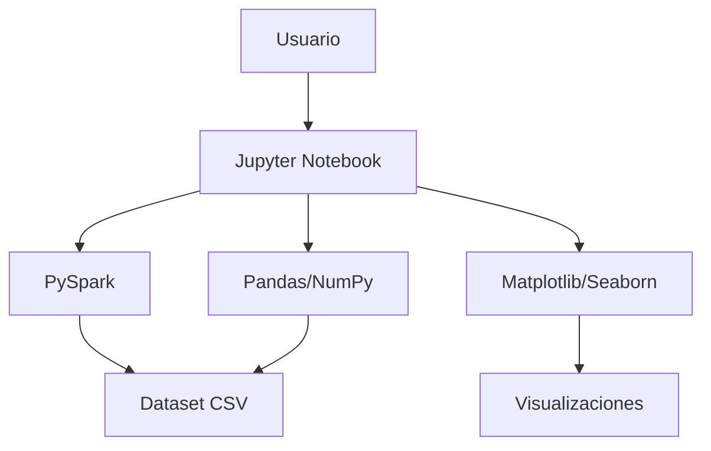
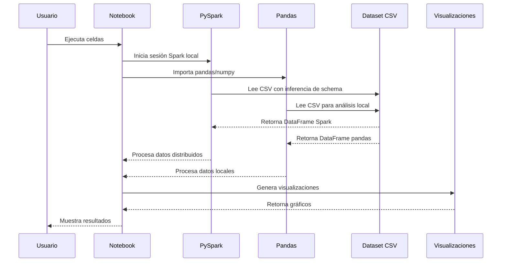

# ARQUITECTURA

## Visión General

Este proyecto sigue una arquitectura de análisis de datos local basada en notebooks de Jupyter con capacidades Big Data mediante PySpark. Es un proyecto de Data Science enfocado en el análisis exploratorio de datos (EDA) y análisis de hipótesis sobre productividad de desarrolladores que utilizan herramientas de IA.

## Diagrama de Componentes



## Estructura del Proyecto

```
BigDataProject/
├── data/
│   └── ai_dev_productivity.csv    # Dataset principal
├── notebooks/
│   ├── 01_eda_inicial.ipynb       # Análisis exploratorio inicial
│   ├── plan1_cafeina_analysis.py  # Script análisis Plan 1
│   └── results/                   # Resultados organizados por plan
│       └── plan1-cafeina/         # Resultados Plan 1
│           ├── plan1_cafeina_boxplot.png
│           ├── plan1_cafeina_histograma.png
│           ├── plan1_cafeina_tasa_exito.png
│           └── plan1_cafeina_estadisticas.txt
├── docs/
│   ├── SPECS.md                   # Especificaciones técnicas
│   ├── ARCHITECTURE.md            # Arquitectura del sistema
│   └── CHANGELOG.md               # Registro de cambios
├── .windsurf/
│   └── plans/                     # Planes de análisis estructurados
├── requirements.txt               # Dependencias Python
└── venv/                          # Entorno virtual
```

## Flujo de Datos



## Patrones Utilizados

- **Notebook Pattern**: Análisis iterativo en celdas con visualización inmediata
- **Hybrid Processing Pattern**: PySpark para procesamiento Big Data + pandas para visualización
- **Data Loading Pattern**: Carga de datos desde archivos CSV locales con inferencia automática
- **Exploratory Analysis Pattern**: Análisis estadístico descriptivo sistemático
- **Hypothesis Testing Pattern**: Planes estructurados para validar hipótesis específicas

## Dependencias Críticas

| Dependencia | Propósito | Riesgo si falla |
|-------------|-----------|-----------------|
| PySpark | Procesamiento Big Data | Crítico - no se puede procesar datasets grandes |
| Java 11 | Runtime PySpark | Crítico - PySpark no funciona |
| Pandas | Manipulación de datos | Crítico - no se puede procesar el dataset |
| Jupyter | Entorno de desarrollo | Alto - no se pueden ejecutar notebooks |
| NumPy | Computación numérica | Medio - afecta rendimiento |
| Matplotlib | Visualización | Bajo - solo afecta gráficos |

## ADR - Architecture Decision Records

### ADR-002: Adopción de PySpark Local en lugar de Hadoop

**Fecha**: 10 de marzo de 2026

**Contexto**: Necesidad de procesamiento Big Data sin la complejidad de configurar Hadoop. El dataset actual (500 registros) no requiere un clúster distribuido, pero se quiere mantener capacidades de escalabilidad para futuros datasets más grandes.

**Decisión**: 
- Utilizar PySpark en modo local (`master("local[*]")`)
- Eliminar dependencia de Hadoop/HDFS
- Mantener enfoque híbrido: PySpark para procesamiento, pandas para visualización

**Alternativas consideradas**:
- Hadoop completo (complejo de configurar, overkill para dataset actual)
- Solo pandas (limitado para escalabilidad futura)
- Dask (menos maduro que PySpark)

**Consecuencias**:
- **Positivas**: Configuración simple, rápido para desarrollo, escalable futuro
- **Negativas**: Sin capacidades distribuidas reales, dependencia de Java

---

### ADR-003: Estructuración de Planes de Análisis

**Fecha**: 10 de marzo de 2026

**Contexto**: Necesidad de organizar el análisis de hipótesis de forma sistemática y reproducible para el proyecto de productividad de desarrolladores.

**Decisión**: 
- Crear planes individuales en `.windsurf/plans/` para cada hipótesis
- Estructura estandarizada: configuración PySpark, análisis, visualización, veredicto
- Enfoque híbrido consistente en todos los planes

**Alternativas consideradas**:
- Notebook único para todo (muy grande, difícil de mantener)
- Scripts Python separados (menos interactivo)
- Sin estructura (caótico, no reproducible)

**Consecuencias**:
- **Positivas**: Organización clara, reproducibilidad, fácil de ejecutar individualmente
- **Negativas**: Mayor cantidad de archivos, requiere disciplina de mantenimiento

### ADR-004: Organización de Resultados por Plan

**Fecha**: 10 de marzo de 2026

**Contexto**: Necesidad de organizar los resultados de análisis de forma estructurada y navegable para facilitar el seguimiento de hipótesis y comparación entre planes.

**Decisión**: 
- Crear carpeta `notebooks/results/` con subcarpetas por plan (`plan1-cafeina/`, `plan2-horas-codigo/`, etc.)
- Cada carpeta contiene: gráficos PNG (boxplot, histograma, etc.) y archivo de estadísticas TXT
- Scripts de análisis guardan resultados automáticamente en sus carpetas correspondientes

**Alternativas consideradas**:
- Todos los resultados en una carpeta flat (difícil de navegar, confuso)
- Resultados mezclados con scripts (mala separación de preocupaciones)
- Sin guardar resultados (pérdida de análisis, no reproducible)

**Consecuencias**:
- **Positivas**: Organización clara, fácil navegación, historial completo, comparación entre planes
- **Negativas**: Mayor estructura de carpetas, requiere consistencia en nombres

---

### ADR-005: Estándar de Calidad de Análisis Obligatorio

**Fecha**: 10 de marzo de 2026

**Contexto**: Necesidad de asegurar calidad consistente y explicaciones comprensibles en todos los análisis de hipótesis. El Plan 1 demostró el valor de documentación detallada, pero se requería estandarización para aplicar a todos los planes futuros.

**Decisión**: 
- Crear estándar de calidad obligatorio con 8 secciones para archivos de estadísticas
- Definir 4 requisitos mínimos para gráficos informativos
- Establecer formato de nomenclatura consistente
- Implementar regla "sin excepción" para cumplimiento de estándares
- Crear memory `bigdata-analysis-standards` como referencia permanente

**Alternativas consideradas**:
- Estándar opcional (riesgo de inconsistencia en calidad)
- Estándar mínimo básico (insuficiente para explicaciones comprensibles)
- Sin estandarización (cada plan con diferente nivel de detalle)

**Consecuencias**:
- **Positivas**: Calidad consistente, explicaciones comprensibles, reproducibilidad, comparación entre planes, aprendizaje mejorado
- **Negativas**: Mayor esfuerzo inicial, requerimiento disciplinario, posible sobrecarga de documentación

---

### ADR-001: Elección del Stack de Análisis de Datos

**Fecha**: 10 de marzo de 2026

**Contexto**: Necesidad de analizar un dataset de productividad de desarrolladores con IA. Se requiere un entorno interactivo para exploración de datos con capacidades de visualización.

**Decisión**: 
- Python 3.14 como lenguaje principal
- Pandas para manipulación de datos
- Jupyter notebooks para análisis interactivo
- Matplotlib/Seaborn para visualizaciones

**Alternativas consideradas**:
- R con RStudio (menos popular en equipo)
- Python con scripts .py (menos interactivo)
- Excel (limitado para análisis estadístico)

**Consecuencias**:
- **Positivas**: Ecosistema rico de librerías, reproducibilidad, documentación integrada
- **Negativas**: Requiere entorno Python gestionado, curva de aprendizaje inicial
